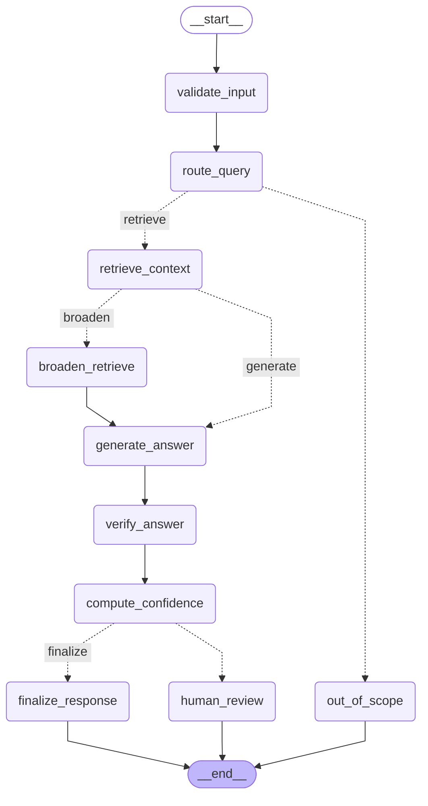

# ME Engineering Assistant

ME Engineering Assistant is an installable Python 3.11 package for answering
questions over ECU product manuals with a grounded RAG workflow. It uses
LangChain-compatible DeepSeek generation, LangGraph workflow orchestration,
keyword/vector/hybrid retrieval, honest evaluation, and MLflow pyfunc packaging.

The implementation intentionally stays as a single-agent RAG system. It has
agent-like control flow through conditional routing, one retrieval retry, and a
human-review branch, without introducing unnecessary multi-agent complexity.

## Architecture



Package layout:

- `me_agent.core`: runtime configuration and shared dataclass schemas.
- `me_agent.ingestion`: Markdown loading and deterministic chunk preprocessing.
- `me_agent.retrieval`: embeddings, FAISS/numpy vector store, and keyword/vector/hybrid retrievers.
- `me_agent.generation`: DeepSeek generation, grounded fallback, prompts, and answer verification.
- `me_agent.workflow`: LangGraph workflow, routing, confidence, and human-review branching.
- `me_agent.evaluation`: Expected_Answer similarity, token coverage, latency, and MLflow eval logging.
- `me_agent.tracking`: MLflow pyfunc model and reusable model logging helpers.
- `me_agent.cli`: console entry points declared in `pyproject.toml`.

## Setup

```bash
python -m venv .venv
source .venv/bin/activate
pip install -e ".[dev]"
python -c "import me_agent"
```

## Model Configuration

Default live generation uses DeepSeek V4 Flash through the OpenAI-compatible API.
Without `DEEPSEEK_API_KEY`, the system falls back to generic extractive synthesis
from retrieved context. The fallback is intentionally not tuned to the evaluation
questions.

```text
ME_AGENT_MODEL_NAME=deepseek-v4-flash
ME_AGENT_OPENAI_BASE_URL=https://api.deepseek.com
ME_AGENT_API_KEY_ENV_VAR=DEEPSEEK_API_KEY
ME_AGENT_RETRIEVER_MODE=hybrid  # keyword | vector | hybrid
ME_AGENT_EMBEDDING_BACKEND=auto # auto | sentence-transformers | hashing
ME_AGENT_ALLOW_EMBEDDING_DOWNLOAD=0
DEEPSEEK_API_KEY=
```

`auto` attempts sentence-transformers first and gracefully falls back to generic
hashing if the package/model is unavailable. To allow the first run to download
`sentence-transformers/all-MiniLM-L6-v2` (roughly 80 MB), set
`ME_AGENT_ALLOW_EMBEDDING_DOWNLOAD=1`. Offline CI can force
`ME_AGENT_EMBEDDING_BACKEND=hashing`.

## Usage

```bash
python scripts/run_agent.py "How much RAM does the ECU-850 have?"
python scripts/run_agent.py "今天天气如何"
ME_AGENT_RETRIEVER_MODE=keyword python scripts/run_eval.py
ME_AGENT_RETRIEVER_MODE=vector python scripts/run_eval.py
ME_AGENT_RETRIEVER_MODE=hybrid python scripts/run_eval.py
python scripts/log_mlflow_model.py
python scripts/load_mlflow_model.py
```

## Evaluation

Evaluation no longer uses question-id-specific facts or route/source pass/fail
rules. It compares each agent answer to the CSV `Expected_Answer` using semantic
similarity plus expected-token coverage. Route and source fields remain in
`eval_results.json` as diagnostics.

`python scripts/run_eval.py` starts an MLflow run, logs metrics, and logs
`eval_results.json` as an artifact. Key metrics include accuracy, latency,
`used_llm_rate`, fallback count, mean semantic similarity, and mean token
coverage.

Final measured results on 2026-07-02:

| Mode | Accuracy | used_llm_rate | Avg latency | Max latency | Mean similarity | Mean token coverage |
| --- | ---: | ---: | ---: | ---: | ---: | ---: |
| Live DeepSeek (`deepseek-v4-flash`) | 1.00 | 1.00 | 2.9374s | 5.2371s | 0.6935 | 0.7248 |
| No-key extractive fallback | 0.70 | 0.00 | 0.0034s | 0.0119s | 0.5487 | 0.5704 |

The offline score is intentionally reported as lower because the fallback is a
generic extractor, not a hidden set of canned answers.

## Validation

Recommended checks:

```bash
python -m compileall src tests scripts
pytest -q
pylint src/me_agent
python scripts/run_eval.py
python scripts/log_mlflow_model.py
python scripts/load_mlflow_model.py
```

Current tests cover importability without hard dependency on `.env`, generic
fallback behavior, out-of-domain routing, conditional graph branches, retrieval
modes, vector index build-once behavior, generic evaluation fields, and MLflow
model input handling.

## Limitations

- No-key fallback is extractive and may be less polished than live DeepSeek output.
- Sentence-transformers may need a first-run model download unless hashing fallback is used.
- FAISS is preferred, but numpy similarity fallback keeps offline runs from hard-crashing.
- Reranking is future work; hybrid retrieval currently merges keyword-first and vector results.
- Live evaluation quality and latency depend on provider/network availability.
