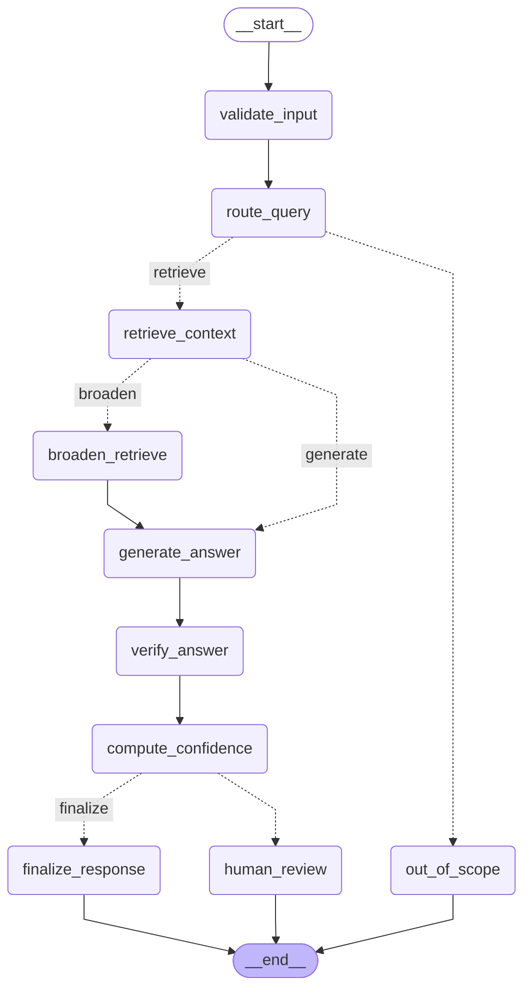

# Architecture

ME Engineering Assistant is a package-first RAG system over Markdown ECU manuals.
It uses a single LangGraph workflow with conditional control flow rather than a
large multi-agent framework.

## LangGraph Workflow

Flow summary:

1. `validate_input` rejects empty questions.
2. `route_query` routes ECU-manual questions and sends unrelated questions to `general`.
3. `out_of_scope` returns a direct scope response without retrieval.
4. `retrieve_context` calls the configured retriever with route-required sources.
5. `broaden_retrieve` runs at most once when initial retrieval confidence is too low.
6. `generate_answer` uses DeepSeek when configured, otherwise generic extraction.
7. `verify_answer` checks answer/context overlap.
8. `compute_confidence` combines retrieval score, source coverage, and verifier score.
9. Low-confidence or unsupported answers branch to `human_review`; otherwise they finalize.

## Package Boundaries

- `me_agent.core`: configuration and shared dataclass schemas.
- `me_agent.ingestion`: Markdown loading and chunk creation.
- `me_agent.retrieval`: embedding backends, FAISS/numpy vector indexing, and retriever modes.
- `me_agent.generation`: live DeepSeek calls, extractive fallback, prompts, and answer verification.
- `me_agent.workflow`: LangGraph graph, deterministic routing, confidence, and HITL decisions.
- `me_agent.evaluation`: generic scoring and MLflow evaluation metric logging.
- `me_agent.tracking`: MLflow pyfunc model and reusable model logging helpers.

The root package intentionally stays thin: it exports `AgentConfig` and
`EngineeringAssistant`, while `me_agent.cli` owns console entry points.

## Retrieval Modes

- `keyword`: deterministic token-overlap retrieval. It does not initialize embeddings.
- `vector`: FAISS in-memory search over sentence-transformers embeddings, with generic
  hashing fallback when FAISS or the embedding model is unavailable.
- `hybrid`: keyword results first, vector results second, deduplicated by chunk id.

Reranking is intentionally left as future work so the current system remains easy
to inspect and test.

## Evaluation Strategy

Evaluation uses `Expected_Answer` from the CSV and computes semantic similarity
plus token coverage. Route and source diagnostics are still written for debugging,
but they are not the primary pass/fail criteria. This avoids circular scoring
based on question ids or hardcoded key facts.

## MLflow Packaging

The pyfunc model accepts strings, lists of strings, or DataFrame-like inputs with
a `question` column. Model logging includes a signature, input example, full
resolvable pip requirements, and the manuals/evaluation CSV as artifacts.
