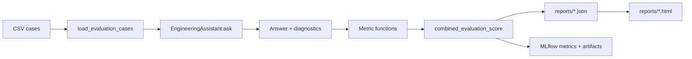
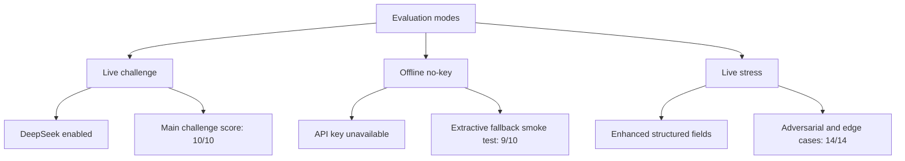

# Evaluation Strategy

This document describes the evaluation system that is actually implemented and
represented by the current artifacts under `reports/`.

The evaluator is not a generic benchmark wrapper. It is a task-specific ECU RAG
evaluator that runs the full assistant graph, records response diagnostics, and
scores each case with answer quality, fact coverage, source coverage, routing,
latency, fallback, and verifier signals.

## Current Artifacts

| Artifact | Purpose | Current result |
| --- | --- | ---: |
| `reports/eval_results.json` | Live DeepSeek run on the 10 challenge questions | 10/10 passed |
| `reports/eval_report.html` | Visual report rendered from live JSON | Generated |
| `reports/eval_results_offline.json` | No-key fallback smoke run on the 10 challenge questions | 9/10 passed |
| `reports/stress_eval_results.json` | Live stress set with enhanced criteria | 14/14 passed |
| `reports/stress_eval_report.html` | Visual report rendered from stress JSON | Generated |

Latest recorded metrics:

| Run | Cases | Accuracy | used_llm_rate | Fallback cases | Avg latency | Max latency | Mean fact recall | Source match | Route match | Forbidden violations |
| --- | ---: | ---: | ---: | ---: | ---: | ---: | ---: | ---: | ---: | ---: |
| Live challenge | 10 | 1.0000 | 1.0000 | 0 | 2.5614s | 4.1594s | 0.9108 | 1.0000 | 1.0000 | 0 |
| Offline no-key | 10 | 0.9000 | 0.0000 | 10 | 0.0031s | 0.0107s | 0.6623 | 1.0000 | 1.0000 | 0 |
| Live stress | 14 | 1.0000 | 0.7857 | 3 | 2.1731s | 4.0309s | 0.9405 | 0.9643 | 0.9286 | 0 |

## Evaluation Pipeline



Each case runs the same production path as a user query:

1. route the question;
2. retrieve source-aware evidence;
3. generate with DeepSeek or deterministic fallback;
4. verify answer support;
5. compute confidence and human-review flag;
6. score the result against expected answer and structured checks.

## Case Schemas

The base challenge CSV uses these required fields:

| Field | Use |
| --- | --- |
| `Question_ID` | Stable case identifier. |
| `Category` | Human-readable bucket for report grouping. |
| `Question` | Input sent to the full assistant graph. |
| `Expected_Answer` | Reference answer for semantic, token, and inferred fact checks. |
| `Evaluation_Criteria` | Human-readable reviewer guidance. It is not parsed as executable logic. |

The stress CSV can add executable criteria:

| Field | Use |
| --- | --- |
| `Required_Facts` | Pipe-separated facts that must appear in the answer. |
| `Forbidden_Facts` | Pipe-separated claims that must not be asserted. |
| `Expected_Sources` | Pipe-separated source filenames expected in response sources. |
| `Expected_Route` | Expected route category, such as `comparison` or `configuration`. |

## Metrics

| Metric | What it checks | Source in JSON |
| --- | --- | --- |
| Semantic similarity | Embedding cosine similarity between expected and actual answer. | `semantic_similarity` |
| Token coverage | Share of important expected-answer tokens found in answer. | `token_coverage` |
| Required fact recall | Share of required facts found in answer. Base rows infer facts from `Expected_Answer`. | `required_fact_recall` |
| Forbidden fact violations | Count of forbidden facts asserted by the answer. Local rejection wording is ignored. | `forbidden_fact_violations` |
| Source match | Recall of expected source filenames in response sources. | `source_match` |
| Route match | 1.0 when expected route equals observed route, or no expected route is configured. | `route_match` |
| Latency | End-to-end time for `assistant.ask`. | `latency_seconds` |
| LLM usage | Whether DeepSeek produced the answer. | `used_llm` |
| Fallback reason | Why fallback was used, for example `out_of_scope` or `verification_contradicted`. | `fallback_reason` |
| Confidence | Workflow confidence combining retrieval, coverage, and verifier status. | `confidence` |
| Human review | Whether the response was flagged as uncertain. | `needs_human_review` |

## Scoring Formula

The default pass threshold is `ME_AGENT_EVAL_PASS_THRESHOLD`, currently `0.45`
from `AgentConfig` unless overridden.

Base rows use:

```text
0.45 * semantic_similarity
+ 0.20 * token_coverage
+ 0.35 * required_fact_recall
```

Enhanced stress rows use:

```text
0.35 * semantic_similarity
+ 0.20 * token_coverage
+ 0.25 * required_fact_recall
+ 0.10 * source_match
+ 0.10 * route_match
- forbidden_fact_penalty
```

Forbidden fact penalty is capped at `0.35`.

Important honesty note: source and route are currently scored as weighted
signals, not absolute hard gates. That is why a case can pass while still
showing a route or source diagnostic gap. The JSON and HTML reports expose those
diagnostics so they are visible during review.

## Live, Offline, and Stress Runs



Run commands:

```bash
# Live/default evaluation
python scripts/run_eval.py \
  --output reports/eval_results.json \
  --html-report reports/eval_report.html

# Stress evaluation
python scripts/run_eval.py \
  --eval-path data/eval/stress-questions.csv \
  --output reports/stress_eval_results.json \
  --html-report reports/stress_eval_report.html \
  --title "ME Agent Stress Evaluation"

# Re-render an HTML report from existing JSON
python scripts/render_eval_report.py \
  reports/eval_results.json \
  reports/eval_report.html
```

## What the Reports Are For

The JSON artifacts are the source of truth for automated metrics. The HTML
reports are for human review during interviews or demos:

- summary cards show pass rate, latency, fallback, and LLM usage;
- case details show question, expected answer, actual answer, route, sources,
  confidence, verifier status, and score;
- failed-case sections make regressions easy to inspect;
- stress reports show whether adversarial, out-of-scope, and negative-evidence
  cases behaved correctly.

## Current Limitations

The current evaluator is useful and honest, but it is still heuristic.

| Limitation | Current handling | Production upgrade |
| --- | --- | --- |
| Weighted score can hide specific failures. | Source and route diagnostics are visible in JSON/HTML. | Make selected checks hard gates by case type. |
| Semantic similarity depends on embedding backend. | Reports expose backend behavior through fallback and metrics. | Pin production embedding model and report version/hash. |
| `Evaluation_Criteria` is human-readable only. | Executable checks come from structured columns. | Convert criteria into typed, executable assertions. |
| Fact matching is phrase/token based. | Good for model IDs, units, commands, and feature acronyms. | Add claim-level verifier and evidence IDs. |
| Offline run is lower quality by design. | Treated as degradation smoke test, not main score. | Separate offline smoke from production eval gate. |

## Interview Summary

The evaluation system demonstrates Tier 3 because it is more than a single
accuracy number. It runs the full agent, records detailed diagnostics, supports
structured stress checks, logs MLflow metrics/artifacts, and renders visual HTML
reports for review.

The most important caveat is also explicit: current pass/fail is a weighted
score. For production, I would preserve the same metrics but promote critical
checks such as forbidden facts, expected route, expected sources, and numeric
contradictions into hard gates for the relevant case types.
