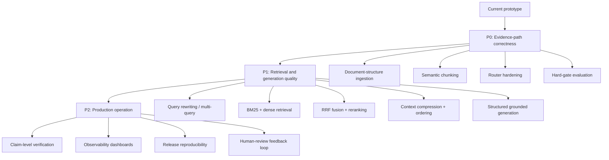
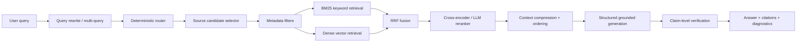

# Scalability Plan Showcase

Concise visual summary of current limitations and the production roadmap.

## Starting Point

The current system is a strong challenge prototype, not a finished production
RAG platform. The important strength is that the boundaries are already clean:
ingestion, routing, retrieval, generation, verification, evaluation, tracking,
and packaging are separate.

The scalable direction is not "add a bigger LLM first." The scalable direction
is to make the evidence path stronger: better chunks, better source selection,
better retrieval, better grounded generation, and stricter evaluation gates.

## Roadmap Overview

## P0: Evidence-Path Correctness

| Area | Current limitation | Scalable upgrade | Why it matters |
| --- | --- | --- | --- |
| Document-structure ingestion | Current chunking is deterministic and simple; tables or spec rows can be split from headings. | Parse Markdown structure: headings, tables, rows, section paths, source file, model name, and stable row IDs. | ECU specs often live in tables. Retrieval needs the value and its section/model context together. |
| Semantic chunking | Fixed-size chunks are easy to run, but they do not know whether a paragraph is complete. | Split by semantic units: one table row, one procedure, one feature description, or one comparison block. | High-cohesion chunks improve retrieval signal and reduce irrelevant context sent to the LLM. |
| Metadata enrichment | Chunks currently carry basic source metadata. | Add metadata such as `model`, `series`, `section`, `spec_type`, `unit`, `version`, and `chunk_id`. | Metadata enables filtering, source coverage checks, and precise citations. |
| Router hardening | Rule matching is explainable but can over-trigger on weak terms. | Use word-boundary matching, co-occurrence rules, and a declarative rule table. | Keeps routing deterministic while reducing false positives and false negatives. |
| Hard-gate evaluation | Weighted scores can hide specific failures. | Promote required facts, forbidden facts, route, source, and numeric contradiction checks into gates by case type. | A high average score should not hide a wrong source or unsupported numeric spec. |

## P1: Retrieval and Generation Quality

| Area | Current state | Scalable upgrade | Why it matters |
| --- | --- | --- | --- |
| Source candidate selection | `ALL_SOURCES` works for three manuals. | First select a bounded set of candidate manuals by model, series, feature, and metadata before chunk retrieval. | Searching every manual does not scale to hundreds of sources. |
| Query rewriting | Current retrieval mostly uses the original query. | Rewrite vague questions into standalone technical queries; expand synonyms such as `rough conditions` -> `operating temperature`. | User wording often differs from manual wording. |
| Multi-query retrieval | Current hybrid retrieval merges keyword and vector results. | Generate several query variants and retrieve from each, then merge candidates. | Improves recall for paraphrases and comparison questions. |
| Hybrid retrieval | Keyword, vector, and hybrid modes already exist. | Use BM25 for exact specs/IDs, dense retrieval for semantic recall, and RRF to combine rankings. | BM25 protects exact terms like `ECU-850b`, `5 TOPS`, and commands; dense retrieval helps paraphrases. |
| Reranking | Current hybrid retrieval is not production-grade score fusion. | Rerank top candidates with a cross-encoder or lightweight LLM reranker. | The first retriever should recall broadly; the reranker should decide which evidence is actually useful. |
| Context compression | Current prompt includes evidence lines and retrieved chunks. | Extract only the necessary sentences/rows before generation. | Reduces prompt noise, cost, and the chance that the model uses irrelevant evidence. |
| Context ordering | Current evidence is ranked but not optimized for LLM attention. | Put the highest-signal chunks near the beginning or end of the prompt. | Helps avoid "lost in the middle" behavior. |
| Structured generation | Current answer is grounded text with source filenames. | Return answer text plus cited evidence IDs and unsupported-claim slots. | Makes verification and debugging easier than checking free-form text only. |

## P2: Auditability and Production Operation

| Area | Current state | Scalable upgrade | Why it matters |
| --- | --- | --- | --- |
| Claim-level verification | Current verifier checks numeric grounding and token support. | Split the answer into claims and verify each claim against cited evidence. | A mostly correct answer can still contain one dangerous unsupported spec. |
| Derived facts | Current verifier is conservative with unseen numbers. | Allow controlled derivations when evidence supports the arithmetic, such as `+105°C - +85°C = 20°C`. | Prevents useful comparison answers from being rejected as hallucinations. |
| Observability | JSON, HTML, and MLflow artifacts exist. | Add dashboards for route mix, fallback rate, retrieval confidence, reranker score, verifier status, and eval trend. | Production debugging needs trend signals, not only one report. |
| Release reproducibility | MLflow logs source and artifacts. | Pin corpus hash, parser version, embedding model, index ID, prompt version, and package versions. | If an answer changes, we need to know whether the cause was code, data, model, prompt, or index. |
| Human-review loop | Low-confidence flag exists. | Convert human review decisions into new routing tests, retrieval tests, eval cases, or corpus fixes. | Review should improve the system, not just produce one-off notes. |

## Target Evidence Path

## RAG Evaluation Expansion

| Layer | Current metric | Production metric |
| --- | --- | --- |
| Retrieval | Source match, route match, fact recall. | Context precision, context recall, source coverage, top-k evidence hit rate. |
| Generation | Semantic similarity, token coverage, required fact recall. | Faithfulness, answer relevancy, claim support rate, citation correctness. |
| Reliability | Fallback count, verifier status, confidence. | Fallback quality by reason, human-review agreement, regression trend by category. |
