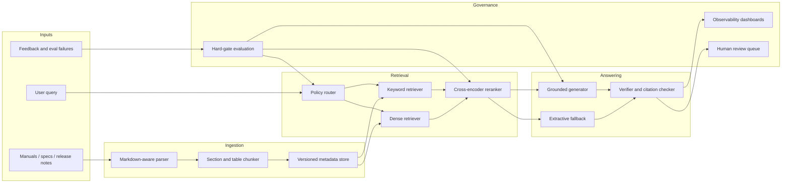
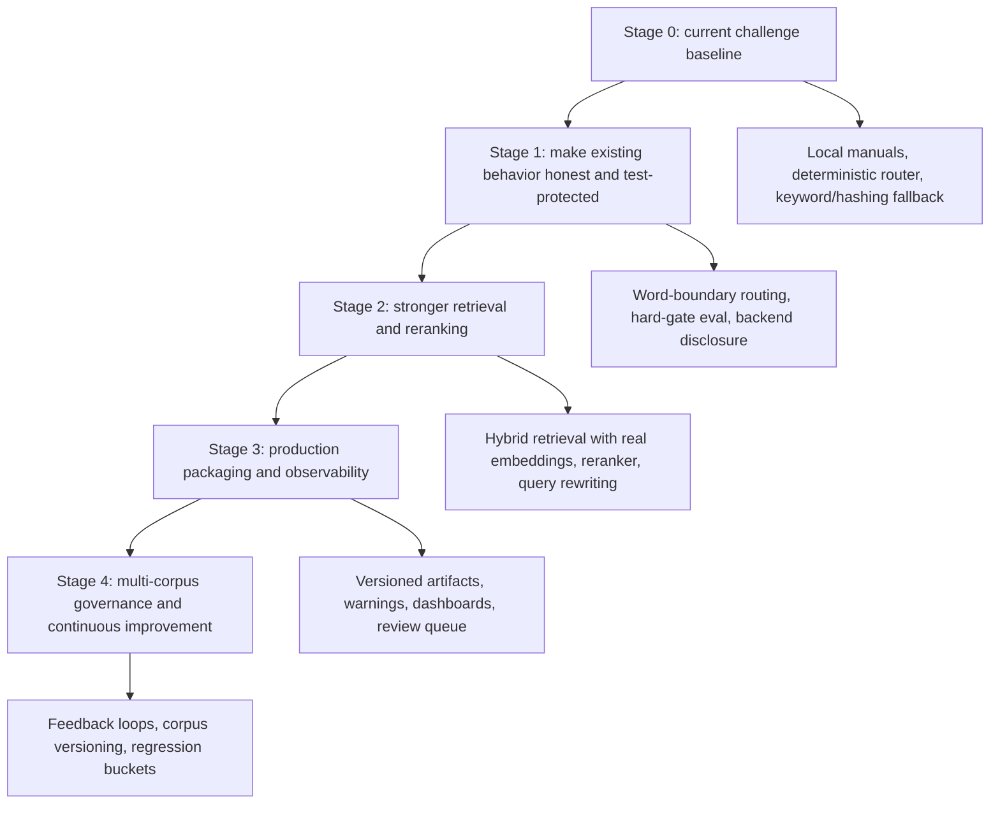
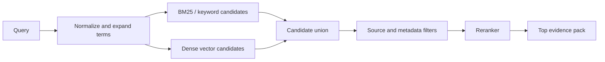
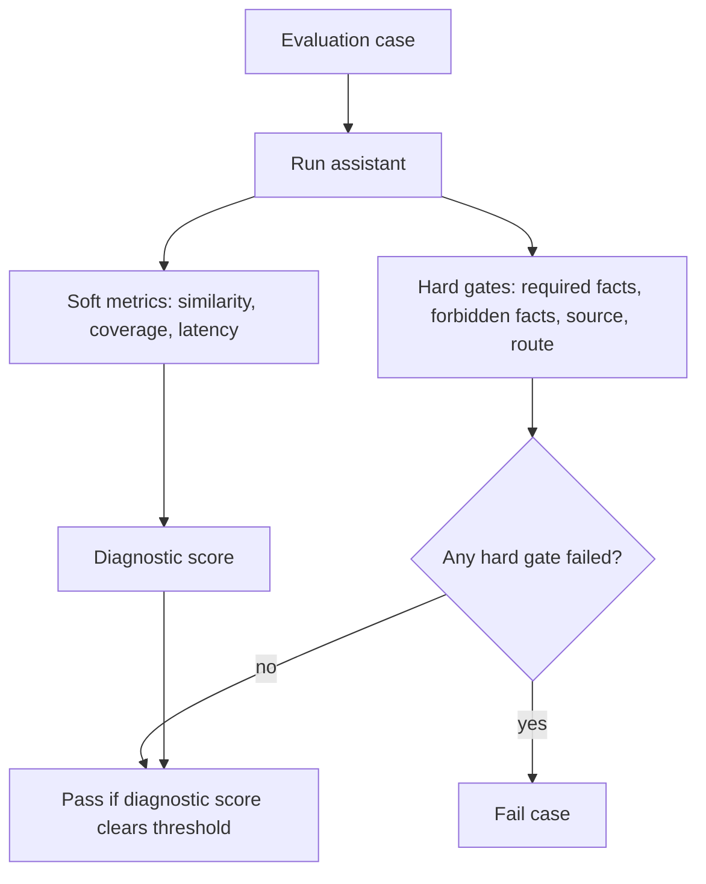

# Scalability Strategy

This document explains how the current ME Agent can evolve from a small,
offline-friendly ECU manual assistant into a stronger production RAG system. The
current implementation is intentionally conservative: deterministic routing,
local retrieval, grounded generation, extractive fallback, and MLflow packaging
keep the challenge system inspectable and reproducible. The scalable version
should preserve those correctness properties while replacing the brittle parts
with explicit, testable, observable components.

## Current Constraint

The present corpus is tiny: three Markdown manuals and a small golden/stress
evaluation set. For that size, local in-memory indexing and deterministic rules
are the right baseline. A managed vector service, heavy reranker, distributed
ingestion pipeline, or LLM router would add more operational complexity than
quality benefit.

The important scalability question is therefore not "how do we add every RAG
component now?" It is "which seams should stay stable so each layer can be
upgraded when corpus size, query ambiguity, or production reliability
requirements increase?"

## Target Architecture

The target design keeps the current control principle: the LLM should not own
the critical control path. Routing, retrieval policy, source constraints,
verification, and evaluation gates remain deterministic or explicitly scored.
The LLM is used where it is strongest: synthesizing a concise answer from
retrieved evidence.

## Evolution Roadmap

## 1. Router Scalability

Current router behavior is deterministic and easy to debug, but the matching
rules are too loose for a larger query surface.

| Current issue | Why it exists now | Scalable improvement |
| --- | --- | --- |
| Substring matching can misroute words such as `best`, `most`, `across`, and `can`. | It was the fastest way to create a transparent routing baseline for a small challenge corpus. | Replace raw substring checks with word-boundary matching, phrase matching, and regression tests for false positives. |
| Scope detection is high recall and treats terms such as `can`, `power`, `memory`, and `driver` as domain signals. | Early routing preferred recall over precision because downstream grounding can absorb some false positives, while missed in-scope questions are unrecoverable. | Require weak terms to co-occur with strong ECU signals such as model IDs, `NPU`, `RAM`, `CAN`, `OTA`, `firmware`, or known manual entities. |
| `elif` order encodes implicit priority. | For a small rule set, a simple chain is easier to read than a rule engine. | Move to a declarative routing table with `rule_id`, `priority`, `category`, `source_policy`, and test fixtures. |
| The router ignores imperative user semantics. | This intentionally keeps control flow resistant to prompt injection such as "ignore the manuals." | Keep control-flow resistance, but add intent tests for negation and scope, such as "do not compare, only describe ECU-850." |

Longer term, an LLM router can be added only as an assistant to the deterministic
policy, not as the authority. The safer pattern is: deterministic policy creates
candidate routes, an LLM or classifier proposes a route with confidence, and the
system only accepts the proposal when it agrees with source constraints and
regression-tested policy rules.

## 2. Retrieval Scalability

The current corpus can be handled by local keyword retrieval. The scalable path
is to improve recall and precision only when the corpus justifies it.

| Layer | Current approach | Scaling trigger | Upgrade |
| --- | --- | --- | --- |
| Chunking | Character windows with overlap. | Tables or sections start splitting across chunks. | Markdown-aware section and table chunking with stable chunk IDs. |
| Keyword retrieval | Deterministic token overlap. | Corpus grows beyond a few manuals or synonyms increase. | BM25 or equivalent lexical search with field boosts for title, model, and spec table rows. |
| Dense retrieval | Sentence-transformers when available, hashing fallback otherwise. | Real paraphrase queries become common. | Pin a production embedding model and store embeddings in a persistent vector index. |
| Hybrid merge | Keyword-first deduped merge. | Candidate quality varies by query type. | Score-normalized fusion, source-aware quotas, then cross-encoder reranking. |
| Metadata filters | Route-required sources. | More product lines and manual versions appear. | Filter by product family, model, version, document type, release date, and language. |

The current hashing fallback should remain available for offline smoke tests, but
reports must label it as hashing rather than semantic retrieval. Production
quality claims should be based on the actual embedding backend and reranker
configuration used for that run.

## 3. Generator and Verifier Scalability

The current generator is deliberately availability-first: DeepSeek is used when
configured; otherwise the system falls back to extractive synthesis from
retrieved evidence. This is a good reliability posture, but the production
version needs clearer separation between answer synthesis, safety policy, and
verification.

| Component | Current reason | Scalable improvement |
| --- | --- | --- |
| Grounded prompt | Keeps the LLM constrained to retrieved manual context. | Add structured evidence blocks with chunk IDs, document versions, and required citation IDs. |
| Extractive fallback | Keeps no-key and provider-failure runs usable and reproducible. | Keep fallback, but clearly mark fallback responses and track fallback rates as reliability metrics. |
| Domain fact bonus | Helps offline fallback catch ECU-specific concepts such as thermal tolerance, OTA, and NPU. | Move the bonus rules into versioned domain configuration instead of hardcoded Python logic. |
| Numeric verifier | Catches high-risk engineering hallucinations such as false temperatures, RAM, frequency, or current. | Extend verification into citation coverage, entity consistency, unit normalization, and contradiction checks. |
| Prompt-injection handling | Current verification catches some false numeric claims, not all instruction attacks. | Add explicit input policy classification and output policy checks; do not market numeric verification as complete injection defense. |

The goal is not to make the LLM "more trusted." The goal is to make every answer
traceable to evidence, every unsupported answer visibly downgraded, and every
provider failure observable.

## 4. Evaluation Scalability

The current evaluation is useful for challenge validation, but it is not yet a
production quality gate. The biggest issue is not the existence of metrics; it is
that a weighted score can hide important failure modes.

Scalable evaluation should use hard gates for correctness-critical behavior:

- Required facts must appear for spec lookup and comparison cases.
- Forbidden facts must be absent for negative evidence and injection cases.
- Expected sources must be retrieved for cross-manual questions.
- Expected route must match for routing regression cases.
- Out-of-scope questions must avoid retrieval and model calls.
- Provider fallback should be tracked separately from answer correctness.

The weighted score can remain as a diagnostic, but it should not be the only pass
condition for adversarial, safety, or negative-evidence cases. The stress set
should grow from one example per bucket into multiple paraphrases per failure
mode: routing ambiguity, missing model, conflicting manuals, negative evidence,
prompt injection, table lookup, unit conversion, and multi-hop filtering.

## 5. Packaging and Reproducibility Scalability

MLflow packaging is already a good direction because it captures the model
interface, artifacts, and runtime configuration. The next step is to remove
version ambiguity.

| Current approach | Why it is acceptable now | Production direction |
| --- | --- | --- |
| `code_paths` packages the current source tree. | It makes the pyfunc artifact self-contained for review. | Use `code_paths` for development artifacts, but use pinned package versions for release artifacts. |
| Package version falls back to a constant if the package is not installed. | It avoids empty MLflow metadata during local logging. | Read the version from `pyproject.toml`; if unavailable, log `unknown` rather than a fake version. |
| Manuals and eval CSV are logged as artifacts. | This makes the challenge run reproducible. | Add corpus version, document hash, parser version, embedding model version, and index build ID. |
| Local SQLite MLflow is the default. | It keeps local runs easy. | Allow remote tracking in CI and production, with comparable run tags and dashboards. |

## 6. Observability and Human Review

Scalability is not just handling more documents. It also means knowing when the
system is failing. The current workflow already has confidence and human-review
branching; the production version should make those signals operational.

Minimum production metrics:

- Route distribution by category and product family.
- Out-of-scope rate and false in-scope review rate.
- Retrieval empty rate, low-confidence retry rate, and reranker drop rate.
- Embedding backend actually used, not just requested.
- LLM used rate, fallback rate, provider error rate, and timeout rate.
- Verifier status distribution: supported, partially supported, unsupported,
  contradicted.
- Human-review rate, review reasons, and accepted correction categories.
- Evaluation pass rate by bucket, not only aggregate accuracy.

Human review should not be a dead end. Each reviewed case should become one of:

- a routing regression fixture,
- a retrieval/chunking regression fixture,
- a domain terminology update,
- a prompt or verifier improvement,
- or a documentation/corpus issue.

## 7. Known Pitfalls and Upgrade Map

| Area | Current pitfall | Why it exists now | Upgrade path |
| --- | --- | --- | --- |
| Router | Substring matching and loose scope rules. | Fast, deterministic baseline for a small corpus. | Word-boundary matching, co-occurrence scope rules, declarative priority table. |
| Router | Priority hidden in `elif` order. | Simpler than a rule engine for the challenge size. | Rule table with explicit priority and regression tests. |
| Retrieval | Hashing fallback can be mistaken for semantic retrieval. | Offline reproducibility and no-download CI support. | Always expose actual backend; only claim semantic retrieval with a real embedding model. |
| Retrieval | Hybrid mode is keyword-first merge, not full score fusion. | Avoids unused weighting knobs and remains inspectable. | Add score-normalized fusion and reranking when candidate diversity matters. |
| Generation | Fallback has ECU-specific bonus logic. | Improves no-key answer quality on known manual concepts. | Move concept boosts into versioned domain configuration. |
| Verification | Numeric grounding is narrower than full injection defense. | Engineering numbers are the highest-risk, easiest-to-check facts. | Add policy checks and citation coverage; describe current verifier honestly. |
| Evaluation | Weighted score can hide route/source failures. | Early metrics needed to tolerate wording variation. | Add hard gates for adversarial, negative, route, and source cases. |
| Packaging | Artifact source and package source can diverge. | Self-contained review artifacts are useful. | Separate development artifact strategy from release artifact strategy. |
| Observability | Fallback and provider failures can look like normal answers. | Availability-first design prevents hard crashes. | Emit warnings, MLflow tags, and dashboard panels for degradation paths. |

## Interview Summary

The current system made the correct early trade-off for a constrained challenge:
keep routing deterministic, keep retrieval local, keep generation grounded, keep
fallback offline-friendly, and make evaluation reproducible. Those decisions
minimize moving parts and keep the correctness path inspectable.

The scalable version should not replace that discipline with a larger opaque
LLM pipeline. It should make the deterministic pieces more precise, make
retrieval stronger only when the corpus requires it, make generation and
verification more traceable, and turn evaluation plus human review into a
continuous improvement loop.
