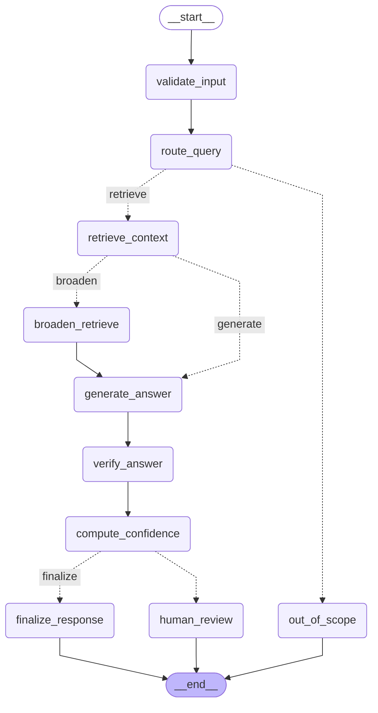
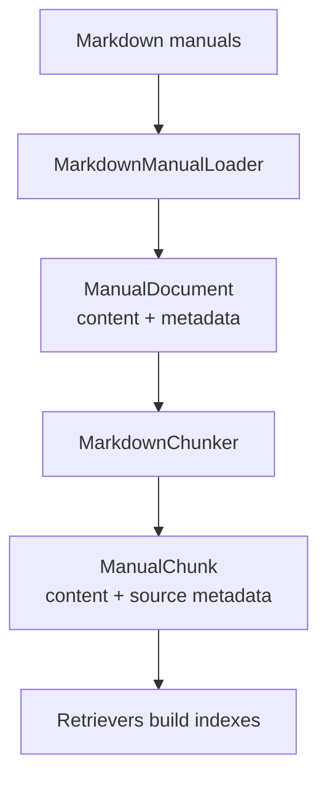
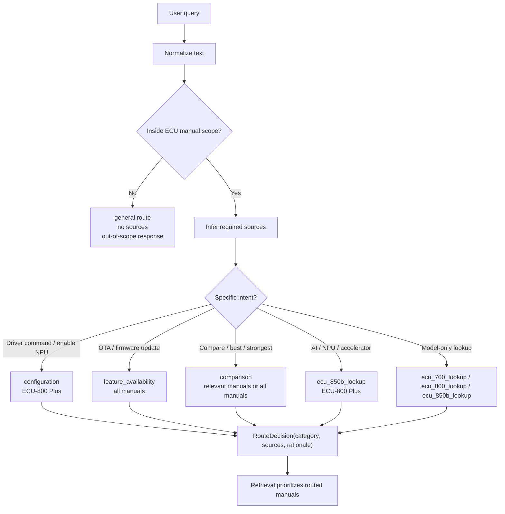
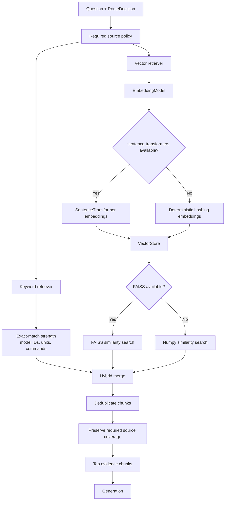
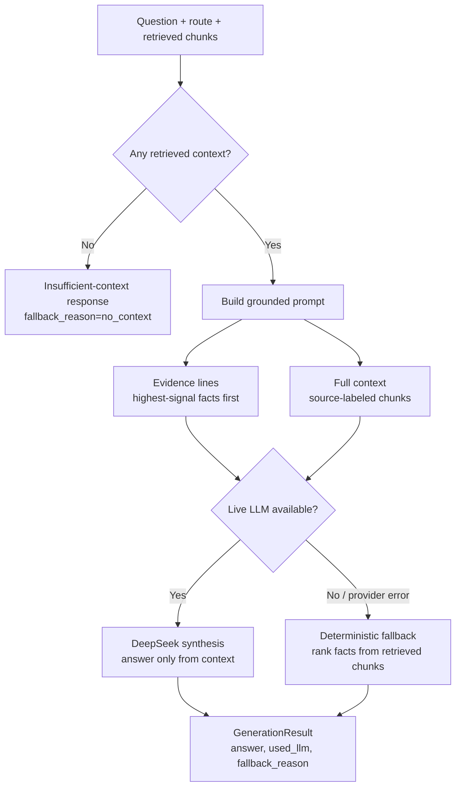
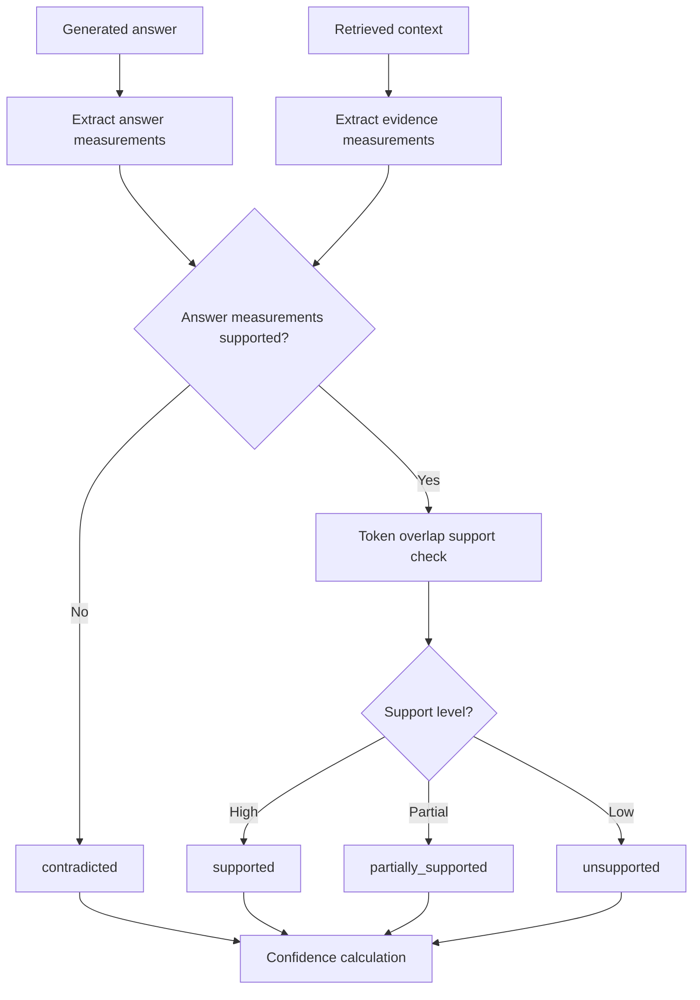

# System Design Showcase

The core design principle is evidence-path control. In an industrial setting,
wrong specs can lead to wrong engineering decisions, so the system prioritizes
grounded evidence, traceable sources, and conservative behavior when support is
weak.

## Runtime Graph

## Layer Map

| Layer | Code area | What it does | Why it matters |
| --- | --- | --- | --- |
| Config/schema | `core/` | Runtime settings and shared response types. | Keeps graph, eval, and MLflow using the same contracts. |
| Ingestion | `ingestion/` | Load Markdown manuals and create stable chunks. | Makes evidence deterministic and citable. |
| Routing | `workflow/router.py` | Classify query scope, route category, and source policy. | Prevents the LLM from controlling retrieval scope. |
| Retrieval | `retrieval/` | Keyword, vector, and hybrid evidence search. | Finds manual chunks before generation. |
| Generation | `generation/llm.py` | DeepSeek answer or deterministic fallback. | Keeps no-key and provider-failure paths usable. |
| Verification | `generation/verifier.py` | Numeric grounding and support checks. | Catches high-risk ECU spec hallucinations. |
| Workflow | `workflow/graph.py` | LangGraph orchestration and branches. | Makes the runtime path explicit and testable. |
| Evaluation | `evaluation/` | Score answers and write JSON/HTML reports. | Turns quality into reviewable artifacts. |
| Tracking | `tracking/` | MLflow pyfunc packaging and metadata. | Reproduces code + config + corpus + eval context. |

## Ingestion

Ingestion creates stable, source-aware evidence units before retrieval. The
loader extracts source, document ID, product family, and model metadata; the
chunker creates overlapping chunks that preserve that metadata.

## Routing

The router is the first control-flow decision point. It does not answer the
question; it decides whether the query is inside the ECU manual scope, which
route category applies, and which manuals retrieval should prioritize.

| Signal | Routing effect |
| --- | --- |
| `ECU-750` / `ECU-700` | Prioritize `ECU-700_Series_Manual.md`. |
| `ECU-850` / `ECU-800` | Prioritize `ECU-800_Series_Base.md`. |
| `ECU-850b` | Include `ECU-800_Series_Plus.md`; base ECU-800 context may also apply. |
| OTA / firmware update | Route to `feature_availability` and check all manuals. |
| Compare / best / strongest / harshest / which model | Route to `comparison` and expand to cross-model evidence. |
| NPU / AI / edge inference / accelerator | Route to `ecu_850b_lookup`, because those details live in the plus addendum. |
| No ECU manual signal | Return an out-of-scope route instead of using general model knowledge. |

Routing is deterministic rather than LLM-based because the domain is small and
the routing signals are explicit: model names, feature names, technical specs,
and comparison language. This keeps routing low-latency, low-cost,
reproducible, and easy to unit test.

It also protects the retrieval policy. The LLM is used for grounded synthesis,
but it does not decide which manuals are valid sources. Prompt text such as
"ignore the manuals" cannot change the source policy.

## Retrieval Design
Retrieval starts from the route decision. The router decides the required source
policy, while the retriever decides which chunks inside that policy are the best
evidence for generation.

Keyword retrieval protects exact engineering facts such as model IDs, numeric
specs, units, and driver commands. Vector retrieval improves recall for
paraphrased questions by embedding chunks once and searching them through FAISS
when available, with numpy similarity as the local fallback. If the semantic
embedding stack is unavailable, deterministic hashing keeps offline runs
reproducible, but it is treated as a fallback rather than production semantic
retrieval.

## Generation

`generation/llm.py` turns retrieved evidence into the final answer. It does not
decide routing or retrieval scope; it only synthesizes from the chunks already
selected by the workflow.

The prompt puts curated `EVIDENCE_LINES` before full `CONTEXT` so the model sees
exact specification rows and high-signal facts first. Comparison and
feature-availability routes get comparison-oriented instructions; lookup routes
prefer exact values from evidence lines and tables.

If the live model is unavailable, deterministic fallback ranks facts by question
overlap, domain-specific matches such as thermal tolerance to operating
temperature, and retrieval score. This keeps the assistant usable without the
provider while preserving source-grounded answers.

## Verification

`generation/verifier.py` checks whether generated answers are grounded in the
retrieved evidence before confidence and final response handling. It focuses on
high-risk ECU specifications such as temperature, memory, frequency, current,
TOPS, and Mbps.

The verifier is intentionally narrow. It is not a universal fact checker; it is
a practical grounding layer for the engineering facts most likely to cause harm
if hallucinated.

## Tier Coverage

| Tier | Evidence in project |
| --- | --- |
| Tier 1 | Multi-source ECU RAG, LangGraph workflow, intelligent routing, MLflow pyfunc, 10/10 live eval. |
| Tier 2 | Installable package, tests, fallback/error handling, monitoring fields, model metadata. |
| Tier 3 | Custom evaluator, stress set, JSON/HTML reports, MLflow logging, human-review flag, scalability plan. |
