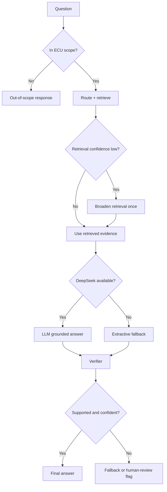
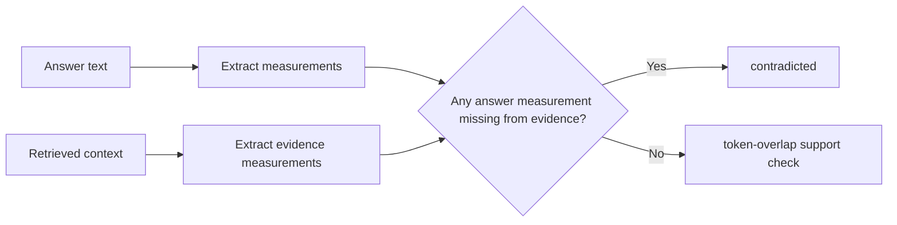

# Interview Showcase: Fallback Design

Use this to explain what happens when the system is missing context, optional
dependencies, provider access, or confidence.

## Design Principle

```text
Prefer a grounded, inspectable degraded answer over a fluent unsupported one.
```

Fallbacks are explicit. They are recorded in response metadata and evaluation
artifacts instead of being hidden.

## Fallback Map



## Fallback Table

| Fallback | Trigger | Behavior | Tradeoff |
| --- | --- | --- | --- |
| Out of scope | Router returns `general`. | Skip retrieval and LLM, return scoped answer. | May reject unknown ECU-like phrasing if router is too strict. |
| Embedding hashing | Sentence-transformers unavailable or disabled. | Convert tokens to deterministic vectors. | Runnable offline, but not true semantic embeddings. |
| Numpy vector search | FAISS missing or source filtering needed. | Use normalized matrix multiplication. | Portable for small corpus, not large-scale indexing. |
| Retrieval broadening | First pass confidence is low. | Relax source constraints once. | Recovers narrow routing, but may add noise. |
| Extractive generation | Missing key, import failure, provider error, or empty response. | Rank retrieved facts and cite sources. | Less fluent than LLM output. |
| Verification fallback | Answer introduces unsupported numeric specs. | Do not silently trust the answer. | Numeric-focused, not full semantic proof. |
| Human review | Confidence/support is low. | Mark response for review. | Flag exists; production queue is future work. |

## High-Risk Case: Numeric Hallucination



This is important because ECU answers often contain temperatures, RAM, clock
speed, current draw, TOPS, or Mbps values. A fluent wrong number is worse than a
less polished grounded answer.

## Current Evaluation Evidence

| Run | What it proves | Current result |
| --- | --- | ---: |
| Live challenge | Full DeepSeek path works on the 10 provided questions. | 10/10 |
| Offline no-key | Retrieval and extractive fallback remain runnable. | 9/10 |
| Stress set | Out-of-scope, negative evidence, injection, exact command, and paraphrase cases. | 14/14 |

Stress fallback reasons currently include:

- `out_of_scope`: two expected refusals;
- `verification_contradicted`: one prompt-injection numeric case grounded back
  to retrieved evidence.

## What I Would Say In Interview

The fallback design is not just defensive coding. It is a quality policy:

- do not answer outside the ECU manual scope;
- do not require optional model downloads for the project to run;
- do not require FAISS for a three-manual local corpus;
- do not crash if DeepSeek is unavailable;
- do not silently return unsupported engineering numbers;
- expose fallback reasons in reports and MLflow metrics.
