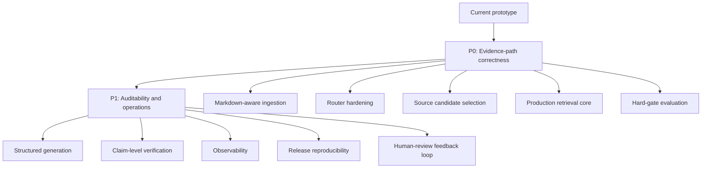
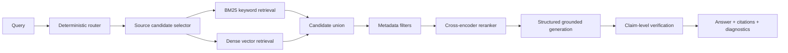

# Interview Showcase: Scalability Plan

Use this as the visual version of the limitations and production roadmap.

## Starting Point

The current system is a strong challenge prototype, not a finished production
RAG platform. The important strength is that the boundaries are already clean:
ingestion, routing, retrieval, generation, verification, evaluation, tracking,
and packaging are separate.

## Roadmap Overview

## P0: Evidence-Path Correctness

| Priority | Current limitation | Upgrade |
| --- | --- | --- |
| Markdown-aware ingestion | Character chunks can split tables or spec rows. | Parse headings, tables, rows, section paths, and stable row IDs. |
| Router hardening | Simple rule matching can over-trigger on weak words. | Word-boundary matching, co-occurrence rules, declarative rule table. |
| Source candidate selection | `ALL_SOURCES` works for 3 manuals, not hundreds. | Select bounded candidate manuals before chunk retrieval. |
| Production retrieval | Token overlap and keyword-first hybrid are transparent but simple. | BM25, pinned embeddings, metadata filters, score fusion, reranker. |
| Hard-gate evaluation | Weighted score can hide route/source/fact failures. | Required facts, forbidden facts, source, route, and numeric checks as gates. |

## P1: Auditability and Production Operation

| Priority | Current state | Upgrade |
| --- | --- | --- |
| Structured generation | Prompt uses evidence lines and context. | Return answer text plus cited evidence IDs and unsupported claims. |
| Claim-level verification | Numeric grounding + token support heuristic. | Split answer into claims and verify each against cited evidence. |
| Observability | JSON, HTML, and MLflow artifacts exist. | Dashboards for route mix, fallback rates, backend changes, verifier status. |
| Release reproducibility | MLflow logs source and artifacts. | Pin package versions, corpus hashes, parser version, embedding version, index ID. |
| Human review loop | Low-confidence branch/flag exists. | Turn reviews into routing tests, retrieval tests, eval cases, or corpus fixes. |

## Target Evidence Path

## Why Not Just Add A Bigger LLM?

- Bigger models do not fix missing evidence.
- Bigger models do not know which manual version is authoritative.
- Bigger models do not automatically enforce source coverage.
- Bigger models can still hallucinate numeric specs.

The production path should strengthen evidence construction, retrieval quality,
verification, and evaluation gates before increasing model complexity.

## Concrete Next Steps

1. Replace character chunking with Markdown/table-aware chunks.
2. Move router rules into a declarative table with regression tests.
3. Add source candidate selection before chunk-level retrieval.
4. Add BM25 and a reranker while keeping keyword explainability.
5. Convert stress-set route/source/fact checks into hard gates.
6. Add structured citations and claim-level verification.
7. Turn human-review cases into new tests and eval rows.

## Interview Close

The scalable plan is to preserve evidence-path control while replacing the
prototype internals with production-grade components. Reliability comes from the
whole evidence path, not from the LLM alone.
