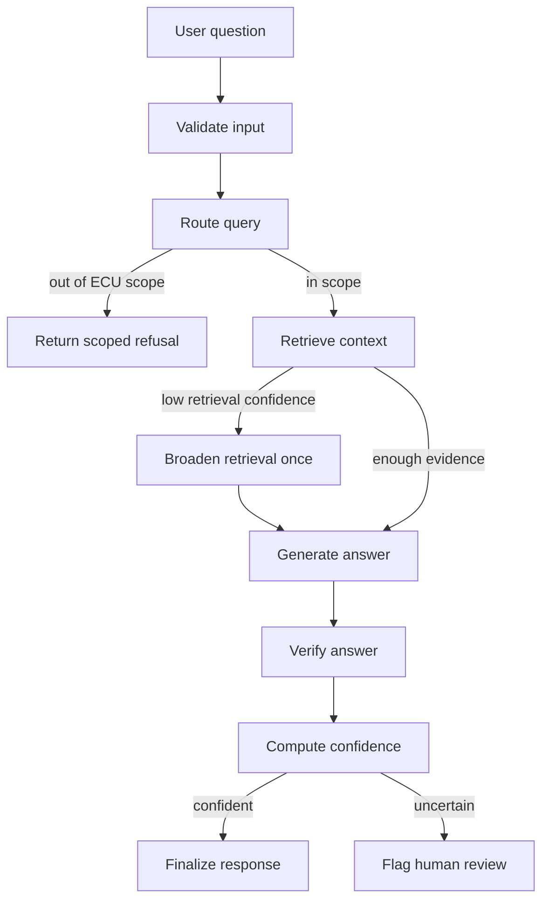
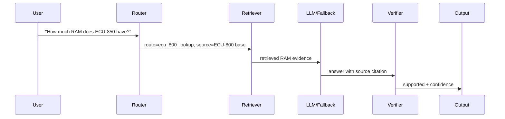

# Interview Showcase: System Design

Use this as the concise visual version of the architecture walkthrough.

## One-Sentence Positioning

ME Agent is a source-aware ECU manual RAG assistant with explicit control over
query scope, source routing, evidence retrieval, grounded generation,
verification, confidence, and evaluation.

## Core Principle

```text
Control the evidence path before asking the LLM to write the answer.
```

The LLM synthesizes from evidence. It does not choose the source policy.

## Runtime Graph



## Layer Map

| Layer | Code area | What it does | Why it matters |
| --- | --- | --- | --- |
| Config/schema | `core/` | Runtime settings and shared response types. | Keeps graph, eval, and MLflow using the same contracts. |
| Ingestion | `ingestion/` | Load Markdown manuals and create stable chunks. | Makes evidence deterministic and citable. |
| Routing | `workflow/router.py` | Classify query scope, route category, and source policy. | Prevents the LLM from controlling retrieval scope. |
| Retrieval | `retrieval/` | Keyword, vector, and hybrid evidence search. | Finds manual chunks before generation. |
| Generation | `generation/llm.py` | DeepSeek answer or deterministic fallback. | Keeps no-key and provider-failure paths usable. |
| Verification | `generation/verifier.py` | Numeric grounding and support checks. | Catches high-risk ECU spec hallucinations. |
| Workflow | `workflow/graph.py` | LangGraph orchestration and branches. | Makes the runtime path explicit and testable. |
| Evaluation | `evaluation/` | Score answers and write JSON/HTML reports. | Turns quality into reviewable artifacts. |
| Tracking | `tracking/` | MLflow pyfunc packaging and metadata. | Reproduces code + config + corpus + eval context. |

## Normal Query Path



## Retrieval Design

| Mode | How it works | Best for |
| --- | --- | --- |
| Keyword | Exact token overlap. | Model IDs, commands, units, numeric specs. |
| Vector | Embedding similarity with FAISS/numpy. | Paraphrased questions. |
| Hybrid | Keyword first, vector recall second. | Current default for balanced precision and recall. |

## Why Deterministic Routing

- Small domain: ECU-700/800 manual signals are explicit.
- Lower cost and latency than LLM routing.
- Easier to unit test.
- Safer control flow: prompt text cannot change the source policy.

## Tier Coverage

| Tier | Evidence in project |
| --- | --- |
| Tier 1 | Multi-source ECU RAG, LangGraph workflow, intelligent routing, MLflow pyfunc, 10/10 live eval. |
| Tier 2 | Installable package, tests, fallback/error handling, monitoring fields, model metadata. |
| Tier 3 | Custom evaluator, stress set, JSON/HTML reports, MLflow logging, human-review flag, scalability plan. |

## Demo Prompts

```text
What is the maximum operating temperature for the ECU-750?
Compare the CAN bus capabilities of ECU-750 and ECU-850.
Which ECU models support Over-the-Air (OTA) updates?
How do you enable the NPU on the ECU-850b?
What is the weather today?
```

## Interview Close

The architecture is intentionally simple where the corpus is small, but the
boundaries are correct. Ingestion, routing, retrieval, generation, verification,
evaluation, and packaging can each improve independently.
